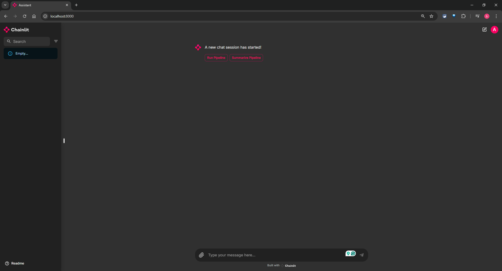
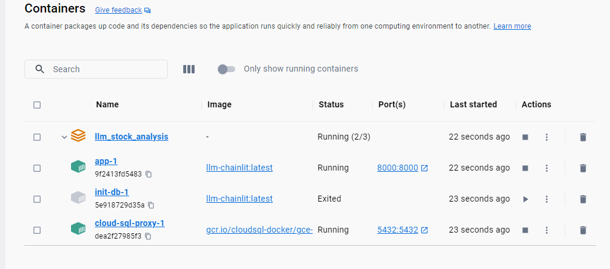
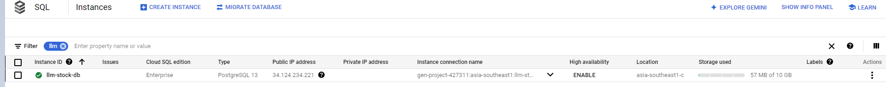
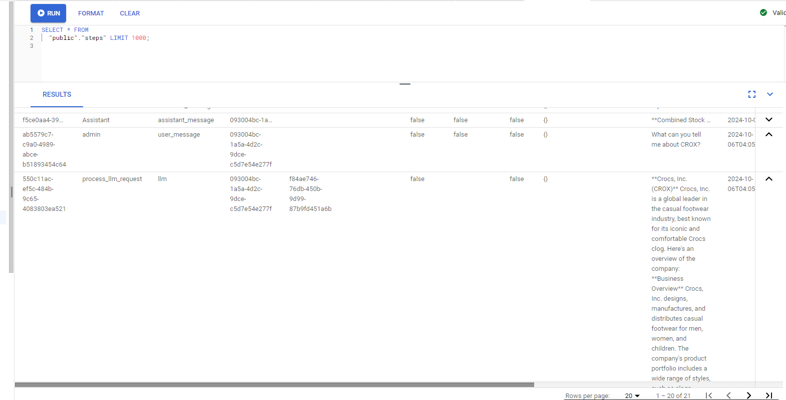
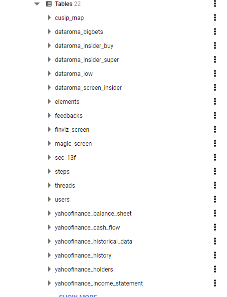

# LLM_Stock_Analysis

This project is the project for the [LLM Zoomcamp](https://github.com/DataTalksClub/llm-zoomcamp) course. This project aims to harness the power of Large Language Models (LLMs) to provide investors with a novel approach to analyzing financial data. By integrating Groq-hosted LLMs with a PostgreSQL database of scraped financial data, this project enables users to interact with financial data in a conversational and intuitive way, using a user-friendly chatbox interface built with Chainlit.

## Table of Contents

- [Problem Statement](#problem-statement)
- [Tools Used](#tools-used)
- [Project Overview](#project-overview)
- [Architecture](#architecture)
- [Reproducibility](#reproducibility)
- [Disclaimer](#disclaimer)
- [Further Improvements](#further-improvements)

## Problem Statement

Traditional financial data analysis can be a time-consuming and labor-intensive process, requiring investors to sift through vast amounts of information to gain valuable insights. This project aims to revolutionize the way investors interact with financial data by developing a conversational AI-powered tool that leverages Large Language Models (LLMs) to summarize and analyze vast amounts of financial information.

The goal is to create a user-friendly chatbox interface that enables investors to quickly and easily query financial data, receive concise and actionable insights, and make informed investment decisions. By automating the data analysis process and providing a natural language interface, this tool has the potential to save investors significant time and effort, while also providing a unique and innovative approach to financial data analysis.

## Tools Used

This project used the tools below.

- Infrastructure Setup: Terraform (for provisioning and managing infrastructure)
- Containerization: Docker and Docker Compose (for containerized deployment and management)
- LLM: Groq API for fast inference (model ids are configured via the `MODEL` / `MODEL_TOOL` environment variables)
- Reproducibility: Makefile (for ease of project reproducibility)
- Chatbot UI: Chainlit (for the chatbot UI)

## Project Overview

### 1. Chatbot UI Interface

The frontend interface built using Chainlit provides a user-friendly chatbot experience where users can interact with the financial data system. It offers a clean interface for conversation and maintains chat history, allowing users to resume previous conversations and maintain context over time.

### 2. Backend Code Hosted in Docker (Python)

The core system is implemented in Python and hosted using a Docker image and Docker Compose. It manages the orchestration of data scraping from multiple sources, handles data processing, and coordinates communication between the different components. This backend code is responsible for executing the business logic and maintaining the flow of data throughout the system.

### 3. Data Sources (SEC 13F, Yahoo Finance, Data Roma)

Multiple data sources are integrated into the system to provide comprehensive financial information. SEC 13F provides institutional filing data, Yahoo Finance offers financial statement data, and Data Roma contributes insider-activity data.

### 4. Groq LLM

This component represents the AI language model integration, using a Groq-hosted model whose id is set through the `MODEL` environment variable. For database questions, the model is given a `sql_query_executor` tool: it writes a PostgreSQL query, the application executes it against a read-only database user, and the model summarizes the result. This is an LLM tool-calling loop over SQL, not vector-based retrieval.

### 5. PostgreSQL Database

The system utilizes a PostgreSQL database (Google Cloud SQL) as its primary data storage solution. This robust database system stores all scraped and processed data, enabling efficient data management, quick retrieval, and persistent storage of historical information.

It also stores the conversation history for further use in monitoring and analysis.

## Architecture

All application code lives in the `stock_analysis` package. Top-level scripts are entrypoints; reusable logic lives in `stock_analysis/helper/`. All database access goes through `helper/sql_processor.py` (SQLAlchemy), and all LLM calls go through `helper/llm_processor.py` (Groq).

| Entrypoint | Purpose | Key helpers |
| --- | --- | --- |
| `stock_analysis/dataroma.py` | Scrape Data Roma insider data into the database | `helper/dataroma_processor.py` |
| `stock_analysis/finviz.py` | Scrape Finviz screener results into the database | `helper/finviz_processor.py` |
| `stock_analysis/magic.py` | Scrape Magic Formula screener results into the database | `helper/magic_processor.py` |
| `stock_analysis/sec_13f.py` | Download and parse SEC 13F filings for super investors | `helper/sec_processor.py`, `helper/stock_detail.py` |
| `stock_analysis/yahoofinance.py` | Scrape Yahoo Finance statements for a ticker list | `helper/yahoo_processor.py` |
| `stock_analysis/llm.py` | Run the batch report pipeline (queries, prompts, six LLM reports) | `helper/pipeline_processor.py`, `helper/llm_processor.py` |
| `stock_analysis/yahoo_llm.py` | Re-run the Yahoo pipeline for the extracted ticker list | `stock_analysis/yahoofinance.py` |
| `stock_analysis/main_ui.py` | Chainlit chat UI; routes messages to the chat or SQL tool agent (read-only DB user) | `helper/pipeline_processor.py` |
| `stock_analysis/init_db.py` | Create the database tables on first run | `helper/sql_processor.py` |
| `stock_analysis/decode_key.py` | Decode the Terraform service-account key output into `key/` | — |

Shared configuration lives in `stock_analysis/settings.py` (environment loading and the database URL builder) and `stock_analysis/constants.py` (table names and external endpoints). Each entrypoint script can also be run directly (e.g. `python stock_analysis/llm.py`) whenever the database and environment variables are available, without the Docker/Chainlit layer.

## Reproducibility

`Prerequisite`:
To reproduce this project you would need
1. [Google Cloud](https://cloud.google.com/) account
2. [Groq API Key](https://groq.com/)
3. [Magic Formula Account](https://www.magicformulainvesting.com/)

You also need the tools below

1. GNU Make (install from your platform's package manager, not PyPI)
2. [Terraform](https://developer.hashicorp.com/terraform/downloads)
3. [Docker](https://www.docker.com/)
4. [Docker Compose](https://docs.docker.com/compose/)

Once all prerequisites are created you will need to update the [.env](.env.example) file and the [terraform variables](infra/terraform.tfvars).

> Note on the Cloud SQL credential: `infra/_sa.tf` mints a long-lived, downloadable service-account key, which is written to `key/service_account.json` and mounted into the Cloud SQL proxy container. This is a tradeoff for local development; for a production deployment, prefer Workload Identity Federation over a downloadable service-account key.

Then follow the steps described in the [Reproduce Guide](other/README.md).

## Disclaimer

This project is designed as a personal experiment to explore the capabilities of Large Language Models (LLMs) in summarizing financial data. While it demonstrates interesting potential, please keep the following in mind:

- For personal use only: This project is intended solely for educational and exploratory purposes. It is not designed to provide financial advice or guide investment decisions.
- Not financial advice: The outputs of this project should not be interpreted as professional financial recommendations. You should always conduct your own research and consult a certified financial advisor before making any investment decisions.
- No guarantees on accuracy: While the AI may offer insights, it is not a substitute for professional financial expertise and should not be relied upon for making financial choices.

This project is a demonstration of what LLMs can achieve in data analysis and summarization, but it is not intended for use in actual financial decision-making.

## Further Improvements

- Deploy the Docker image to a cloud service
- Add more scraping options like recent news or financial reports
