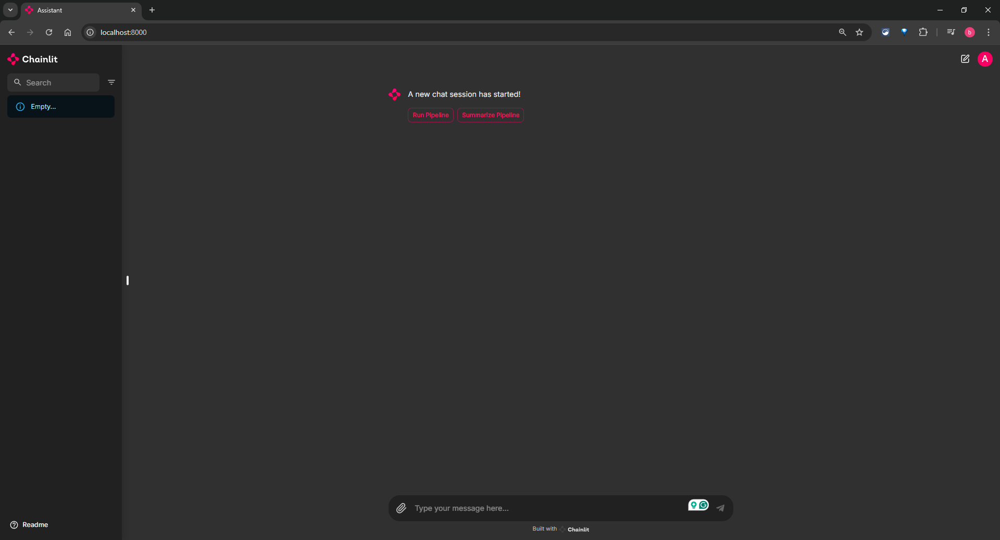
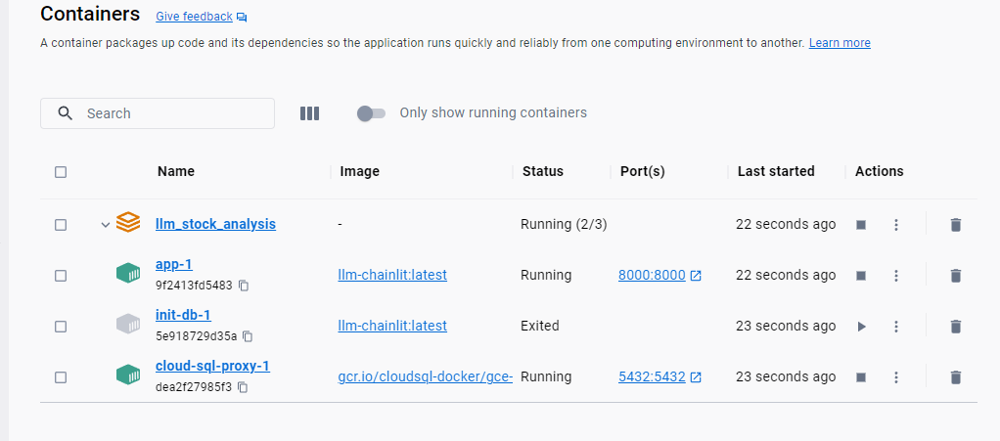
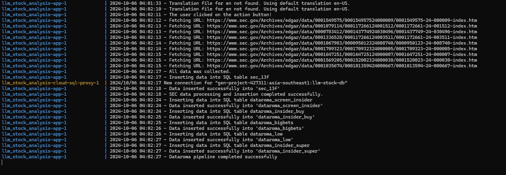
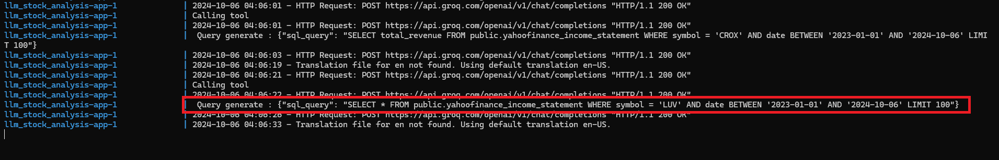
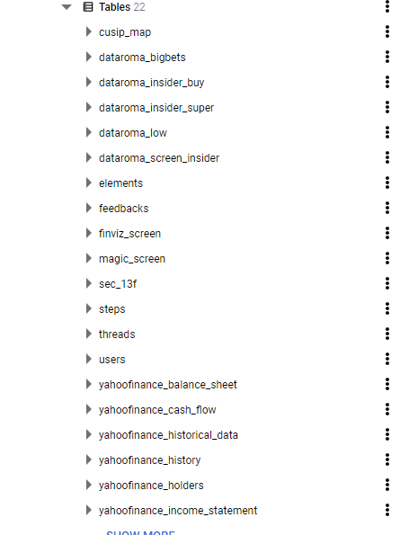
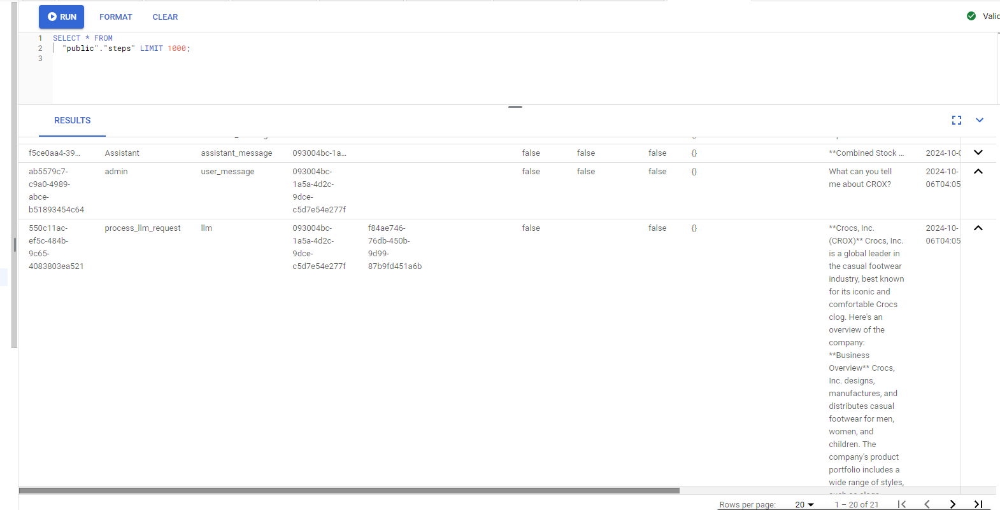

# LLM_Stock_Analysis

This project is the project for LLM Zoomcamp[https://github.com/DataTalksClub/llm-zoomcamp] course. This project aims to harness the power of Large Language Models (LLMs) to provide investors with a novel approach to analyzing financial data. By leveraging a Retrieval-Augmented Generation (RAG) system and integrating with the Groq API for high-speed processing, this project enables users to interact with financial data in a conversational and intuitive way, using a user-friendly chatbox interface built with Chainlit.

## Table of Contents

- [Problem Statement](#problem-statement)
- [Tools Used](#tools-used)
- [Project Overview](#project-overview)
  - [1. Chatbot UI Interface](#1-chatbot-ui-interface)
  - [2. Backend Code Host In Docker (Python)](#2-backend-code-host-in-docker-python)
  - [3. Data Sources (SEC 13f, Yahoo Finance, Data Roma)](#3-data-sources-sec-13f-yahoo-finance-data-roma)
  - [4. GROQ/LLama 3.1](#4-groqllama-31)
  - [5. PostgreSQL Database](#5-postgresql-database)
- [Remider](#remider)
- [Reproducibility](#reproducibility)
## Problem Statement
Traditional financial data analysis can be a time-consuming and labor-intensive process, requiring investors to sift through vast amounts of information to gain valuable insights. This project aims to revolutionize the way investors interact with financial data by developing a conversational AI-powered tool that leverages Large Language Models (LLMs) to summarize and analyze vast amounts of financial information.

The goal is to create a user-friendly chatbox interface that enables investors to quickly and easily query financial data, receive concise and actionable insights, and make informed investment decisions. By automating the data analysis process and providing a natural language interface, this tool has the potential to save investors significant time and effort, while also providing a unique and innovative approach to financial data analysis.

## Tools Used

This project used the tool below.

- Infrastructure Setup: Terraform (for provisioning and managing infrastructure)
- Containerization: Docker and Docker-compose (for containerized deployment and management)
- LLM Model: Groq LLM model offering for fast inference (for LLM model endpoint)
- Reproducibility: Makefile (for ease of project reproducibility)
- Chatbot UI: Chainlit (for UI chatbot)

## Project Overview

### 1. Chatbot UI Interface

The frontend interface built using Chainlit provides a user-friendly chatbot experience where users can interact with the financial data system. It offers a clean interface for conversation and maintains chat history, allowing users to resume previous conversations and maintain context over time.

### 2. Backend Code Host In Docker (Python)

The core system architecture is implemented in Python and host using docker image and docker-compose. It manages the orchestration of data scraping from multiple sources, handles data processing, and coordinates communication between different components. This backend code is responsible for executing the business logic and maintaining the flow of data throughout the system.

### 3. Data Sources (SEC 13f, Yahoo Finance, Data Roma)

Multiple data sources are integrated into the system to provide comprehensive financial information. SEC 13f provides regulatory filing data, Yahoo Finance offers real-time market information, and Data Roma contributes investment-related data.

### 4. GROQ/LLama 3.1

This component represents the AI language model integration, specifically using LLama 3.1 through GROQ's infrastructure. It implements a RAG (Retrieval Augmented Generation) system, enabling intelligent processing of user queries and generation of contextually relevant responses based on the stored financial data.

### 5. PostgreSQL Database

The system utilizes a PostgreSQL database as its primary data storage solution. This robust database system stores all scraped and processed data, enabling efficient data management, quick retrieval, and persistent storage of historical information. 

Also, store the conversation history to be further use for monitoring and analysis

## Reproducibility

`Prerequisite`:
To reproduce this project you would need 
1. [Google Account](https://cloud.google.com/) account
2. [Groq API Key](https://groq.com/)
3. [Magic Fomular Account](https://www.magicformulainvesting.com/)

You also need the package below

1. [Makefile](https://pypi.org/project/make/) `pip install  make`
2. [Terraform](https://developer.hashicorp.com/terraform/downloads)
3. [Docker](https://www.docker.com/)
4. [Docker Compose](https://docs.docker.com/compose/)

Once all prerequisite is created you will need to update the [.env](.env.example) file. and [terraform var](infra/terraform.tfvars)

Then follow the step describe in [Reproduce Step](other/readme.md)

## Remider
This project is designed as a personal experiment to explore the capabilities of Large Language Models (LLMs) in summarizing financial data. While it demonstrates interesting potential, please keep the following in mind:

- For personal use only: This project is intended solely for educational and exploratory purposes. It is not designed to provide financial advice or guide investment decisions.
- Not financial advice: The outputs of this project should not be interpreted as professional financial recommendations. You should always conduct your own research and consult a certified financial advisor before making any investment decisions.
- No guarantees on accuracy: While the AI may offer insights, it is not a substitute for professional financial expertise and should not be relied upon for making financial choices.

This project is a demonstration of what LLMs can achieve in data analysis and summarization, but it is not intended for use in actual financial decision-making.

## Further Improvements
Deploy the Docker Image to Cloud service 

Add more scaping options like recent news or Financial report
